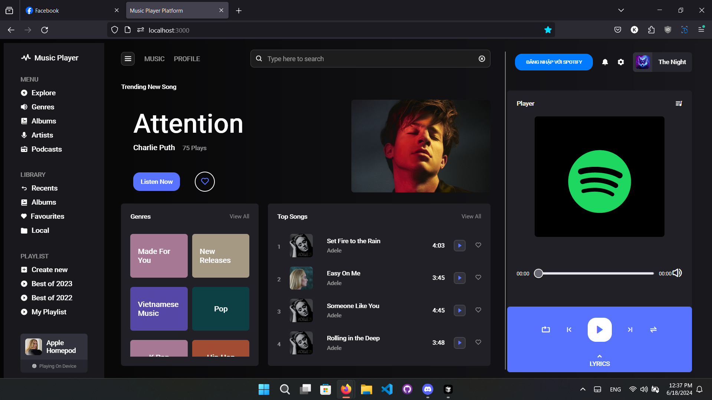

# Music Web Application

A web-based music streaming platform that integrates with Spotify services, providing a seamless music playback experience directly in the browser.


## Demo: https://drive.google.com/file/d/12Pu3Bv0Rzz81PHQCez2lSm15XNxzDU5M/view?usp=sharing

## Features

### Music Playback
- Real-time music streaming using Spotify Web Playback SDK
- Full playback controls (play, pause, skip, seek, volume)
- Now playing information with dynamic updates
- Progress bar with seek functionality

### User Experience
- Responsive design for all devices
- Intuitive music player interface
- Dynamic playlist management
- Real-time playback state synchronization

### Authentication & Security
- Secure OAuth 2.0 authentication with Spotify
- Automatic token refresh mechanism
- Session management

## Technologies Used

- **Frontend:** JavaScript (ES6+), HTML5, CSS3
- **Integration:** Spotify Web API, Spotify Web Playback SDK
- **Authentication:** OAuth 2.0
- **Version Control:** Git

## Prerequisites

- Node.js 
- Spotify Premium Account
- Modern web browser

## Setup & Installation

1. Clone the repository
```bash
git clone [repository-url]
```

2. Install dependencies
```bash
npm install
```

3. Configure environment variables
```bash
SPOTIFY_CLIENT_ID=your_client_id
SPOTIFY_CLIENT_SECRET=your_client_secret
```

4. Start the development server
```bash
npm start
```

## Usage

1. Log in with your Spotify Premium account
2. Browse and search for music
3. Create and manage playlists
4. Enjoy seamless music playback
